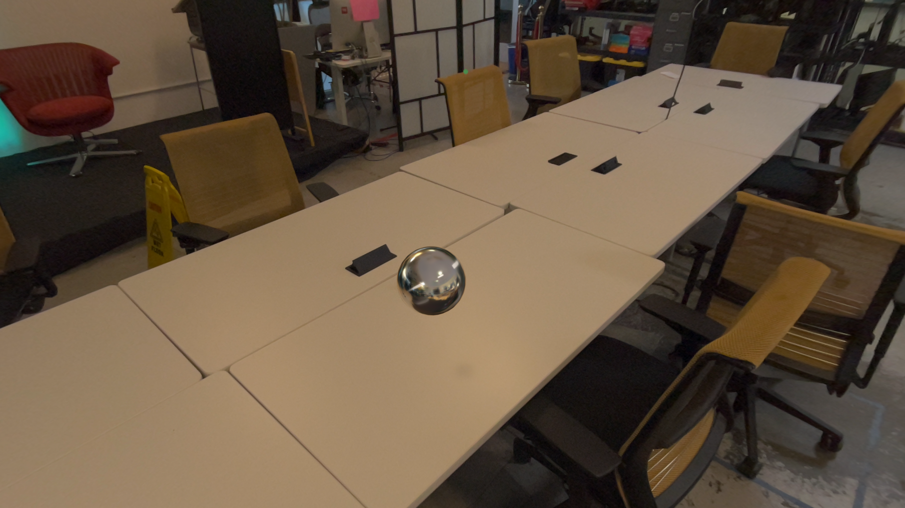

# AnchoringComponentTest
## Use RealityKit to place a shiny sphere on some nearby table. For Vision Pro.

### To build
* Change the project's Development Team and Bundle Identifier
* Run
* There is no step 3!

